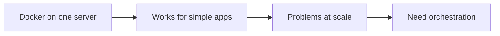
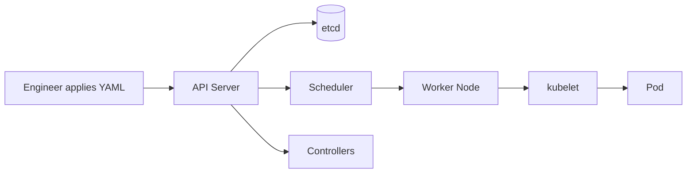
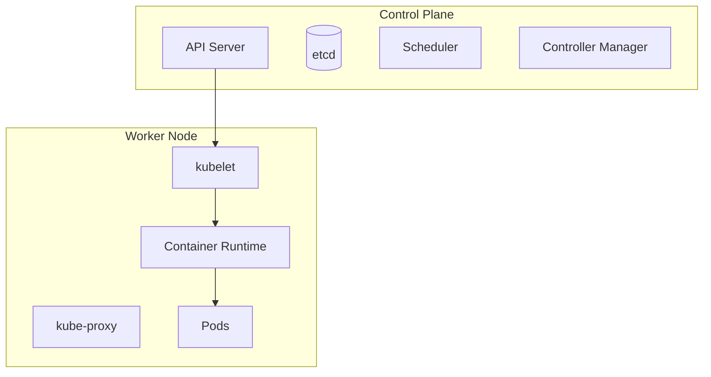
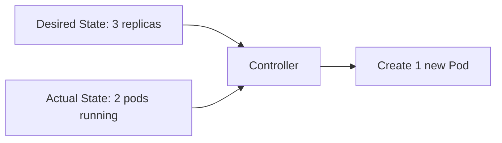
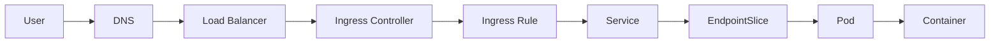
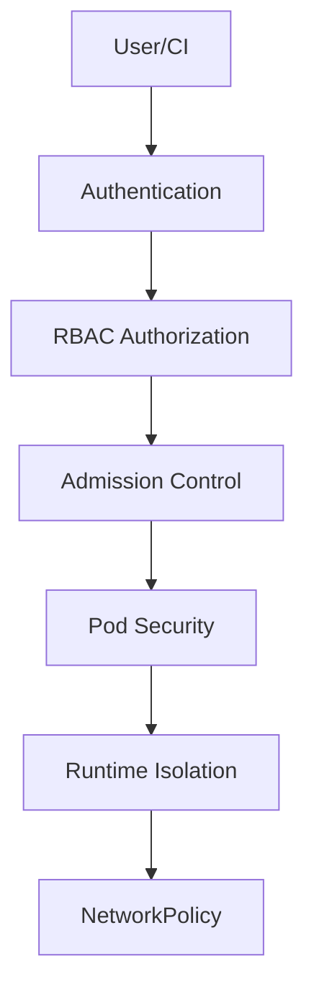

# kubernetes-slides-agent.md

## Goal

Generate a comprehensive Kubernetes slide deck from this markdown specification.

The deck should act as:

* Kubernetes introduction
* Kubernetes cheat sheet
* senior software engineer reference
* best-practice guide
* interview preparation guide

The slides should focus more on **content quality** than heavy visualization, but still include clean, lightweight diagrams where helpful.

Target audience:

* backend engineers
* senior software engineers
* DevOps beginners
* cloud engineers
* engineers familiar with Docker but new to Kubernetes

Tone:

* practical
* technical
* clear
* concise
* senior-engineer oriented
* production-focused

Output:

* Generate an HTML slide deck or markdown slide deck.
* Prefer 16:9 format.
* Use readable layouts.
* Avoid over-designed slides.
* Prefer clean tables, diagrams, YAML snippets, and cheat sheets.
* Use lightweight Mermaid/SVG/CSS diagrams only.

---

# Slide Design Rules

## Content Priority

Each slide should prioritize:

1. accurate explanation
2. practical usage
3. YAML example
4. best practices
5. debugging notes
6. lightweight visual support

Do not make the deck overly visual or marketing-style.

## Visual Style

Use:

* clean technical theme
* dark or light professional theme
* monospace font for commands and YAML
* simple diagrams
* consistent spacing
* readable code blocks

Avoid:

* decorative illustrations
* excessive animations
* dense paragraphs
* generic cloud clipart
* AI-looking gradient-heavy layouts

---

# Required Slide Pattern for Kubernetes Resources

For every major Kubernetes component or resource, use this structure:

```markdown
## What it is
Brief explanation.

## Why it matters
Practical reason engineers need it.

## When to use it
Real scenarios.

## YAML Example
Simplified valid YAML.

## Best Practices
Production recommendations.

## Common Issues
Common mistakes and symptoms.

## Useful Commands
kubectl commands related to this component.
```

---

# Deck Structure

# Section 1 — Why Kubernetes Exists

## Slide 1 — Title

Title: Kubernetes Fundamentals
Subtitle: Introduction, Cheat Sheet, Best Practices, and Interview Reference

Include:

* Docker background
* orchestration motivation
* production-readiness focus

---

## Slide 2 — Course Goals

Cover:

* why Kubernetes exists
* core architecture
* Kubernetes objects
* networking
* storage
* scaling
* security
* observability
* troubleshooting
* interview scenarios

---

## Slide 3 — Docker Drawbacks

Explain Docker limitations when used alone:

* single-host focused
* no built-in multi-node scheduling
* manual container restart strategy
* limited self-healing
* limited service discovery
* manual scaling
* manual rolling deployments
* difficult secret/config management at scale
* no native cluster-wide desired state reconciliation
* operational complexity grows with microservices

Key message:

Docker packages and runs containers. Kubernetes manages containers across a cluster.

Diagram suggestion:



---

## Slide 4 — What Problems Kubernetes Solves

Explain:

* container scheduling
* service discovery
* self-healing
* horizontal scaling
* rolling updates
* declarative desired state
* storage orchestration
* secret/config management
* network abstraction
* multi-node orchestration

Use a comparison table:

| Problem               | Docker Alone | Kubernetes               |
| --------------------- | ------------ | ------------------------ |
| Multi-node scheduling | Manual       | Automated                |
| Container restart     | Basic        | Controller-driven        |
| Scaling               | Manual       | Declarative / autoscaled |
| Service discovery     | Limited      | Built-in Service/DNS     |
| Rolling updates       | Manual       | Deployment strategy      |
| Desired state         | Limited      | Reconciliation loop      |

---

# Section 2 — Kubernetes Overview

## Slide 5 — What Is Kubernetes?

Define Kubernetes:

Kubernetes is an open-source container orchestration platform that manages containerized applications across a cluster of machines using declarative configuration and automated reconciliation.

Explain:

* Kubernetes does not replace containers
* Kubernetes runs containers through a container runtime
* Kubernetes manages desired state
* Kubernetes abstracts infrastructure

Key phrase:

You declare what you want. Kubernetes continuously works to make the cluster match that desired state.

---

## Slide 6 — Why Do We Need Kubernetes?

Explain:

* modern apps are distributed
* services need scaling independently
* infrastructure fails
* deployments must be repeatable
* teams need standard operations
* production requires observability, security, and automation

Use case examples:

* deploy backend API
* scale workers
* expose frontend
* run scheduled jobs
* host microservices
* manage stateful apps
* run platform services

---

## Slide 7 — Docker vs Kubernetes

Table:

| Area           | Docker               | Kubernetes                  |
| -------------- | -------------------- | --------------------------- |
| Main role      | Build/run containers | Orchestrate containers      |
| Scope          | Single host mostly   | Multi-node cluster          |
| Deployment     | docker run / compose | declarative YAML            |
| Scaling        | manual               | declarative/autoscaling     |
| Networking     | container networks   | Services, DNS, ingress, CNI |
| Storage        | volumes              | PV, PVC, StorageClass       |
| Self-healing   | basic restart        | controllers reconcile state |
| Production fit | app packaging        | app operations platform     |

Important note:

Docker and Kubernetes are complementary. Docker builds images. Kubernetes schedules and manages containerized workloads.

---

## Slide 8 — Kubernetes Mental Model

Explain the main mental model:

* YAML describes desired state
* API server stores desired state
* controllers watch state
* scheduler assigns pods to nodes
* kubelet runs pods
* reconciliation loop repairs drift

Diagram:



---

# Section 3 — Kubernetes Architecture

## Slide 9 — Cluster Architecture

Explain:

* cluster = control plane + worker nodes
* control plane makes decisions
* worker nodes run workloads
* kubectl talks to API server

Diagram:



---

## Slide 10 — Control Plane Components

Cover:

* API Server
* etcd
* Scheduler
* Controller Manager
* Cloud Controller Manager

Table:

| Component                | Responsibility                      |
| ------------------------ | ----------------------------------- |
| API Server               | front door of Kubernetes API        |
| etcd                     | stores cluster state                |
| Scheduler                | assigns pods to nodes               |
| Controller Manager       | runs reconciliation controllers     |
| Cloud Controller Manager | integrates with cloud provider APIs |

Best practice:

* run highly available control plane in production
* protect API server access
* back up etcd
* monitor control plane health

---

## Slide 11 — Worker Node Components

Cover:

* kubelet
* kube-proxy
* container runtime
* CNI plugin
* pods

Table:

| Component         | Responsibility                    |
| ----------------- | --------------------------------- |
| kubelet           | ensures pods run on node          |
| kube-proxy        | service networking rules          |
| container runtime | runs containers                   |
| CNI plugin        | pod networking                    |
| pods              | smallest deployable workload unit |

---

## Slide 12 — Declarative Model and Reconciliation

Explain:

* desired state lives in Kubernetes objects
* actual state is what is running
* controllers compare desired vs actual
* controllers continuously reconcile

Example:

If deployment says replicas = 3 and one pod dies, Kubernetes creates a replacement pod.

Diagram:



---

# Section 4 — Kubernetes Object Basics

## Slide 13 — Kubernetes Object Anatomy

Explain fields:

* apiVersion
* kind
* metadata
* spec
* status

YAML:

```yaml
apiVersion: apps/v1
kind: Deployment
metadata:
  name: api
  labels:
    app: api
spec:
  replicas: 3
  selector:
    matchLabels:
      app: api
  template:
    metadata:
      labels:
        app: api
    spec:
      containers:
        - name: api
          image: nginx:1.27
```

Explain:

* `spec` = desired state
* `status` = observed state
* labels connect resources together

---

## Slide 14 — Labels and Selectors

Explain:

Labels are key-value metadata used to organize and select Kubernetes objects.

Use cases:

* service selects pods
* deployment manages pods
* monitoring groups apps
* policies target workloads

YAML:

```yaml
metadata:
  labels:
    app: payment-api
    tier: backend
    env: prod
```

Selector:

```yaml
selector:
  matchLabels:
    app: payment-api
```

Best practices:

* use consistent labels
* include app, component, environment, version
* avoid changing labels used by selectors casually

---

## Slide 15 — Namespaces

What it is:

A namespace is a logical boundary for grouping resources inside a cluster.

Use cases:

* separate teams
* separate environments
* isolate dev/staging/prod
* apply quotas and policies

YAML:

```yaml
apiVersion: v1
kind: Namespace
metadata:
  name: dev
```

Commands:

```bash
kubectl get namespaces
kubectl create namespace dev
kubectl get pods -n dev
kubectl config set-context --current --namespace=dev
```

Best practices:

* do not put everything in default namespace
* combine namespaces with RBAC, quotas, and network policies
* avoid using namespaces as the only security boundary

---

# Section 5 — Workloads

## Slide 16 — Pod

What it is:

A Pod is the smallest deployable unit in Kubernetes. It wraps one or more containers that share network namespace, storage volumes, and lifecycle.

When to use:

* rarely create standalone pods directly in production
* use Deployment, StatefulSet, Job, or DaemonSet instead

YAML:

```yaml
apiVersion: v1
kind: Pod
metadata:
  name: nginx-pod
  labels:
    app: nginx
spec:
  containers:
    - name: nginx
      image: nginx:1.27
      ports:
        - containerPort: 80
```

Best practices:

* do not manage standalone pods for long-running apps
* use controllers
* define requests/limits
* add probes
* avoid privileged containers

---

## Slide 17 — Multi-Container Pod

Explain:

Containers in the same pod share localhost networking and volumes.

Common patterns:

* sidecar
* adapter
* ambassador
* init container

YAML:

```yaml
apiVersion: v1
kind: Pod
metadata:
  name: app-with-sidecar
spec:
  containers:
    - name: app
      image: myapp:1.0
    - name: log-sidecar
      image: busybox
      command: ["sh", "-c", "tail -f /logs/app.log"]
      volumeMounts:
        - name: logs
          mountPath: /logs
  volumes:
    - name: logs
      emptyDir: {}
```

Best practices:

* use sidecars only when lifecycle coupling is necessary
* avoid putting unrelated services in one pod
* keep pod responsibilities cohesive

---

## Slide 18 — Deployment

What it is:

A Deployment manages stateless replicated pods and supports rolling updates and rollbacks.

When to use:

* APIs
* web apps
* stateless workers
* frontend services

YAML:

```yaml
apiVersion: apps/v1
kind: Deployment
metadata:
  name: api
spec:
  replicas: 3
  selector:
    matchLabels:
      app: api
  strategy:
    type: RollingUpdate
    rollingUpdate:
      maxUnavailable: 1
      maxSurge: 1
  template:
    metadata:
      labels:
        app: api
    spec:
      containers:
        - name: api
          image: myorg/api:1.0.0
          ports:
            - containerPort: 8080
```

Commands:

```bash
kubectl get deployments
kubectl rollout status deployment/api
kubectl rollout history deployment/api
kubectl rollout undo deployment/api
kubectl scale deployment/api --replicas=5
```

Best practices:

* use immutable image tags
* define readiness probes
* configure resources
* use rolling update strategy
* avoid using `latest` in production

---

## Slide 19 — ReplicaSet

What it is:

ReplicaSet ensures a specified number of pod replicas are running.

Important:

Usually created and managed by Deployment. Engineers should understand it but rarely create it directly.

Commands:

```bash
kubectl get replicasets
kubectl describe rs
```

Best practices:

* manage stateless apps through Deployment
* do not manually edit ReplicaSets owned by Deployments

---

## Slide 20 — StatefulSet

What it is:

StatefulSet manages stateful applications requiring stable identity, stable network names, and stable storage.

Use cases:

* databases
* Kafka
* Elasticsearch
* ZooKeeper
* Redis clusters

YAML:

```yaml
apiVersion: apps/v1
kind: StatefulSet
metadata:
  name: postgres
spec:
  serviceName: postgres
  replicas: 3
  selector:
    matchLabels:
      app: postgres
  template:
    metadata:
      labels:
        app: postgres
    spec:
      containers:
        - name: postgres
          image: postgres:16
          ports:
            - containerPort: 5432
          volumeMounts:
            - name: data
              mountPath: /var/lib/postgresql/data
  volumeClaimTemplates:
    - metadata:
        name: data
      spec:
        accessModes: ["ReadWriteOnce"]
        resources:
          requests:
            storage: 10Gi
```

Best practices:

* use StatefulSet for stable identity
* understand ordered startup/shutdown
* use proper backup strategy
* do not assume Kubernetes automatically solves database clustering

---

## Slide 21 — DaemonSet

What it is:

DaemonSet ensures one pod runs on each selected node.

Use cases:

* log agents
* monitoring agents
* security agents
* CNI components
* node-level collectors

YAML:

```yaml
apiVersion: apps/v1
kind: DaemonSet
metadata:
  name: node-agent
spec:
  selector:
    matchLabels:
      app: node-agent
  template:
    metadata:
      labels:
        app: node-agent
    spec:
      containers:
        - name: agent
          image: busybox
          command: ["sh", "-c", "while true; do echo running; sleep 30; done"]
```

Best practices:

* use tolerations if agents must run on tainted nodes
* monitor resource usage carefully
* avoid heavy workloads as DaemonSets

---

## Slide 22 — Job

What it is:

A Job runs pods until a task completes successfully.

Use cases:

* batch processing
* database migration
* one-time scripts
* data import/export

YAML:

```yaml
apiVersion: batch/v1
kind: Job
metadata:
  name: db-migration
spec:
  backoffLimit: 3
  template:
    spec:
      restartPolicy: Never
      containers:
        - name: migrate
          image: myorg/migration:1.0
          command: ["npm", "run", "migrate"]
```

Best practices:

* use idempotent jobs
* configure backoffLimit
* capture logs
* avoid destructive migration jobs without rollback plan

---

## Slide 23 — CronJob

What it is:

A CronJob runs Jobs on a schedule.

Use cases:

* nightly cleanup
* scheduled reports
* periodic sync
* backups

YAML:

```yaml
apiVersion: batch/v1
kind: CronJob
metadata:
  name: cleanup
spec:
  schedule: "0 2 * * *"
  concurrencyPolicy: Forbid
  successfulJobsHistoryLimit: 3
  failedJobsHistoryLimit: 3
  jobTemplate:
    spec:
      template:
        spec:
          restartPolicy: Never
          containers:
            - name: cleanup
              image: busybox
              command: ["sh", "-c", "echo cleanup"]
```

Best practices:

* set concurrencyPolicy
* keep jobs idempotent
* monitor failures
* set history limits

---

# Section 6 — Services and Networking

## Slide 24 — Kubernetes Networking Model

Explain:

* every pod gets its own IP
* pods can communicate across nodes
* services provide stable virtual IP/DNS
* ingress/gateway exposes HTTP traffic externally
* CNI implements networking

Key terms:

* Pod IP
* ClusterIP
* NodePort
* LoadBalancer
* Ingress
* Gateway API
* NetworkPolicy
* DNS

---

## Slide 25 — Service

What it is:

A Service provides stable networking and load balancing for a set of pods.

Types:

* ClusterIP
* NodePort
* LoadBalancer
* ExternalName

YAML:

```yaml
apiVersion: v1
kind: Service
metadata:
  name: api-service
spec:
  type: ClusterIP
  selector:
    app: api
  ports:
    - port: 80
      targetPort: 8080
```

Best practices:

* use ClusterIP for internal services
* use LoadBalancer or Ingress/Gateway for external access
* ensure selector matches pod labels
* name ports when using multiple ports

---

## Slide 26 — ClusterIP vs NodePort vs LoadBalancer

Table:

| Type         | Scope                      | Use Case                    |
| ------------ | -------------------------- | --------------------------- |
| ClusterIP    | internal cluster only      | service-to-service          |
| NodePort     | exposes port on every node | testing/simple access       |
| LoadBalancer | cloud/external LB          | public service              |
| ExternalName | DNS alias                  | external dependency mapping |

Best practice:

* avoid NodePort for production public apps
* prefer Ingress/Gateway for HTTP routing
* use LoadBalancer for L4 external services

---

## Slide 27 — Ingress

What it is:

Ingress defines HTTP/HTTPS routing rules from outside the cluster to internal services.

Important:

Ingress requires an Ingress Controller such as NGINX Ingress, Traefik, HAProxy, or cloud provider controller.

YAML:

```yaml
apiVersion: networking.k8s.io/v1
kind: Ingress
metadata:
  name: api-ingress
spec:
  ingressClassName: nginx
  rules:
    - host: api.example.com
      http:
        paths:
          - path: /
            pathType: Prefix
            backend:
              service:
                name: api-service
                port:
                  number: 80
```

Best practices:

* use TLS
* configure timeouts/body limits
* avoid exposing internal-only services
* monitor ingress controller metrics
* standardize ingress annotations

---

## Slide 28 — Request Flow: Internet to Pod

Interview-style explanation:

1. User sends request to domain
2. DNS resolves to load balancer
3. Load balancer sends traffic to ingress controller
4. Ingress controller matches host/path
5. Ingress routes to Service
6. Service selects endpoint pods by label
7. Traffic reaches pod IP and container port

Diagram:



---

## Slide 29 — Gateway API

What it is:

Gateway API is a newer, more expressive Kubernetes networking API for service networking.

Explain:

* GatewayClass
* Gateway
* HTTPRoute
* separation of infra owner and app owner

Simplified YAML:

```yaml
apiVersion: gateway.networking.k8s.io/v1
kind: Gateway
metadata:
  name: web-gateway
spec:
  gatewayClassName: nginx
  listeners:
    - name: http
      protocol: HTTP
      port: 80
```

```yaml
apiVersion: gateway.networking.k8s.io/v1
kind: HTTPRoute
metadata:
  name: api-route
spec:
  parentRefs:
    - name: web-gateway
  rules:
    - backendRefs:
        - name: api-service
          port: 80
```

Best practices:

* consider Gateway API for new platform designs
* use Ingress when ecosystem/tooling already standardizes on it
* separate platform networking ownership from app routing

---

## Slide 30 — DNS in Kubernetes

Explain:

Kubernetes provides DNS names for Services and sometimes Pods.

Examples:

```text
api-service
api-service.default
api-service.default.svc
api-service.default.svc.cluster.local
```

Commands:

```bash
kubectl get svc
kubectl run debug --image=busybox -it --rm -- nslookup api-service
```

Best practices:

* use service DNS names instead of pod IPs
* avoid hardcoding cluster IPs
* debug DNS with temporary pods

---

## Slide 31 — NetworkPolicy

What it is:

NetworkPolicy controls pod-to-pod and pod-to-external network traffic.

Important:

Requires a CNI plugin that supports NetworkPolicy.

YAML:

```yaml
apiVersion: networking.k8s.io/v1
kind: NetworkPolicy
metadata:
  name: allow-api-from-frontend
spec:
  podSelector:
    matchLabels:
      app: api
  policyTypes:
    - Ingress
  ingress:
    - from:
        - podSelector:
            matchLabels:
              app: frontend
      ports:
        - protocol: TCP
          port: 8080
```

Best practices:

* start with default deny in sensitive namespaces
* explicitly allow required traffic
* test policies carefully
* remember DNS egress may be required

---

## Slide 32 — Egress Traffic

Explain:

Egress is outbound traffic from pods to external systems.

Common needs:

* database outside cluster
* third-party APIs
* cloud services
* static outbound IP
* firewall allowlisting

Options:

* NetworkPolicy egress rules
* egress gateway
* NAT gateway
* service mesh egress control

Best practices:

* restrict egress in production
* log outbound traffic
* use egress gateway when static IP is required
* avoid unrestricted internet access for sensitive workloads

---

# Section 7 — Configuration and Secrets

## Slide 33 — ConfigMap

What it is:

ConfigMap stores non-sensitive configuration.

YAML:

```yaml
apiVersion: v1
kind: ConfigMap
metadata:
  name: api-config
data:
  LOG_LEVEL: "info"
  FEATURE_FLAG: "true"
```

Use as env:

```yaml
envFrom:
  - configMapRef:
      name: api-config
```

Best practices:

* do not store secrets in ConfigMaps
* use versioned config changes
* restart pods when config changes if app does not reload dynamically

---

## Slide 34 — Secret

What it is:

Secret stores sensitive values such as tokens, passwords, and certificates.

YAML:

```yaml
apiVersion: v1
kind: Secret
metadata:
  name: api-secret
type: Opaque
stringData:
  DATABASE_PASSWORD: "change-me"
```

Use as env:

```yaml
env:
  - name: DATABASE_PASSWORD
    valueFrom:
      secretKeyRef:
        name: api-secret
        key: DATABASE_PASSWORD
```

Best practices:

* do not commit raw secrets to Git
* enable encryption at rest
* use external secret managers when possible
* rotate secrets
* restrict access with RBAC

---

## Slide 35 — ServiceAccount

What it is:

A ServiceAccount gives pods an identity for accessing the Kubernetes API or cloud-integrated permissions.

YAML:

```yaml
apiVersion: v1
kind: ServiceAccount
metadata:
  name: api-service-account
```

Use in pod:

```yaml
spec:
  serviceAccountName: api-service-account
```

Best practices:

* avoid using default service account
* disable unnecessary token mounting
* follow least privilege
* bind only required permissions

---

# Section 8 — Storage

## Slide 36 — Volume Basics

Explain:

Container filesystem is ephemeral. Volumes provide data sharing or persistence.

Types:

* emptyDir
* configMap
* secret
* persistentVolumeClaim
* projected
* hostPath

YAML:

```yaml
volumes:
  - name: cache
    emptyDir: {}
```

Best practices:

* use emptyDir for temporary data only
* avoid hostPath unless necessary
* use PVCs for persistent application data

---

## Slide 37 — PersistentVolume and PersistentVolumeClaim

What it is:

* PersistentVolume = storage resource
* PersistentVolumeClaim = request for storage

PVC YAML:

```yaml
apiVersion: v1
kind: PersistentVolumeClaim
metadata:
  name: api-data
spec:
  accessModes:
    - ReadWriteOnce
  resources:
    requests:
      storage: 10Gi
```

Use in pod:

```yaml
volumes:
  - name: data
    persistentVolumeClaim:
      claimName: api-data
```

Best practices:

* use StorageClass for dynamic provisioning
* understand access modes
* backup stateful data
* monitor disk usage

---

## Slide 38 — StorageClass

What it is:

StorageClass defines how dynamic storage is provisioned.

YAML:

```yaml
apiVersion: storage.k8s.io/v1
kind: StorageClass
metadata:
  name: fast-ssd
provisioner: kubernetes.io/aws-ebs
parameters:
  type: gp3
reclaimPolicy: Retain
volumeBindingMode: WaitForFirstConsumer
```

Best practices:

* use WaitForFirstConsumer for topology-aware scheduling
* choose reclaim policy carefully
* use Retain for critical data
* document storage classes for app teams

---

# Section 9 — Scaling and Scheduling

## Slide 39 — Resource Requests and Limits

Explain:

* requests influence scheduling
* limits cap resource usage
* missing requests causes poor scheduling
* wrong limits can cause throttling or OOMKilled

YAML:

```yaml
resources:
  requests:
    cpu: "250m"
    memory: "256Mi"
  limits:
    cpu: "500m"
    memory: "512Mi"
```

Best practices:

* always set requests
* set memory limits carefully
* avoid overly strict CPU limits for latency-sensitive apps
* monitor real usage before tuning

---

## Slide 40 — HorizontalPodAutoscaler

What it is:

HPA automatically adjusts pod replica count based on metrics.

YAML:

```yaml
apiVersion: autoscaling/v2
kind: HorizontalPodAutoscaler
metadata:
  name: api-hpa
spec:
  scaleTargetRef:
    apiVersion: apps/v1
    kind: Deployment
    name: api
  minReplicas: 3
  maxReplicas: 10
  metrics:
    - type: Resource
      resource:
        name: cpu
        target:
          type: Utilization
          averageUtilization: 70
```

Best practices:

* define resource requests
* use custom metrics for better scaling
* avoid too-low minReplicas for production
* test scaling behavior

---

## Slide 41 — Cluster Autoscaler vs HPA vs VPA

Table:

| Autoscaler         | Scales              | Example                         |
| ------------------ | ------------------- | ------------------------------- |
| HPA                | number of pods      | scale API from 3 to 10 replicas |
| VPA                | pod requests/limits | tune memory/cpu                 |
| Cluster Autoscaler | number of nodes     | add worker nodes                |

Best practices:

* HPA needs schedulable capacity
* Cluster Autoscaler helps when nodes are full
* VPA may conflict with HPA on CPU/memory
* use metrics-driven autoscaling

---

## Slide 42 — Scheduling: NodeSelector, Affinity, Taints, Tolerations

Explain:

* nodeSelector: simple node matching
* affinity: advanced scheduling preference/requirement
* taints: repel pods
* tolerations: allow pods onto tainted nodes

YAML:

```yaml
nodeSelector:
  workload: gpu
```

```yaml
tolerations:
  - key: "dedicated"
    operator: "Equal"
    value: "platform"
    effect: "NoSchedule"
```

Best practices:

* use labels consistently
* avoid over-constraining scheduling
* use taints for dedicated nodes
* use topology spread constraints for resilience

---

## Slide 43 — PodDisruptionBudget

What it is:

PDB limits voluntary disruptions so enough pods remain available during maintenance.

YAML:

```yaml
apiVersion: policy/v1
kind: PodDisruptionBudget
metadata:
  name: api-pdb
spec:
  minAvailable: 2
  selector:
    matchLabels:
      app: api
```

Best practices:

* use PDB for production services
* ensure replica count supports disruption budget
* do not set impossible budgets
* combine with readiness probes

---

# Section 10 — Health Checks and Reliability

## Slide 44 — Liveness, Readiness, Startup Probes

Explain:

* liveness: should container be restarted?
* readiness: should pod receive traffic?
* startup: has slow-starting app finished booting?

YAML:

```yaml
livenessProbe:
  httpGet:
    path: /healthz
    port: 8080
  initialDelaySeconds: 30
  periodSeconds: 10

readinessProbe:
  httpGet:
    path: /ready
    port: 8080
  periodSeconds: 5

startupProbe:
  httpGet:
    path: /startup
    port: 8080
  failureThreshold: 30
  periodSeconds: 10
```

Best practices:

* do not make liveness too aggressive
* readiness should check dependencies needed to serve traffic
* startup probe protects slow apps
* avoid probes that are expensive

---

## Slide 45 — Rolling Updates and Rollbacks

Commands:

```bash
kubectl set image deployment/api api=myorg/api:1.1.0
kubectl rollout status deployment/api
kubectl rollout history deployment/api
kubectl rollout undo deployment/api
```

Best practices:

* use readiness probes
* use maxSurge/maxUnavailable
* monitor during rollout
* use immutable image tags
* keep rollback path available

---

# Section 11 — Security

## Slide 46 — Kubernetes Security Layers

Cover:

* cluster access
* API authentication
* RBAC authorization
* namespaces
* pod security
* network policies
* image security
* secrets management
* runtime security

Diagram:



---

## Slide 47 — RBAC: Role and RoleBinding

Role YAML:

```yaml
apiVersion: rbac.authorization.k8s.io/v1
kind: Role
metadata:
  namespace: dev
  name: pod-reader
rules:
  - apiGroups: [""]
    resources: ["pods"]
    verbs: ["get", "list", "watch"]
```

RoleBinding YAML:

```yaml
apiVersion: rbac.authorization.k8s.io/v1
kind: RoleBinding
metadata:
  name: read-pods
  namespace: dev
subjects:
  - kind: ServiceAccount
    name: api-service-account
    namespace: dev
roleRef:
  kind: Role
  name: pod-reader
  apiGroup: rbac.authorization.k8s.io
```

Best practices:

* least privilege
* avoid cluster-admin
* bind permissions to service accounts
* audit permissions regularly

---

## Slide 48 — SecurityContext

What it is:

SecurityContext controls Linux security settings for pods and containers.

YAML:

```yaml
securityContext:
  runAsNonRoot: true
  runAsUser: 10001
  seccompProfile:
    type: RuntimeDefault
containers:
  - name: api
    image: myorg/api:1.0.0
    securityContext:
      allowPrivilegeEscalation: false
      readOnlyRootFilesystem: true
      capabilities:
        drop: ["ALL"]
```

Best practices:

* run as non-root
* disable privilege escalation
* drop Linux capabilities
* use read-only root filesystem when possible
* avoid privileged pods

---

## Slide 49 — Image Security

Best practices:

* use trusted base images
* pin image versions
* scan images in CI/CD
* avoid latest tag
* minimize image size
* remove package managers from runtime image
* use multi-stage builds
* sign images when possible

Tools:

* Trivy
* Docker Scout
* Grype
* Cosign
* admission controllers

---

# Section 12 — Observability and Troubleshooting

## Slide 50 — Observability Pillars

Cover:

* logs
* metrics
* traces
* events
* health checks

Tools:

* Prometheus
* Grafana
* Loki
* ELK/OpenSearch
* Jaeger
* OpenTelemetry
* Kubernetes events
* metrics-server

---

## Slide 51 — Logs

Commands:

```bash
kubectl logs pod/api-123
kubectl logs deployment/api
kubectl logs pod/api-123 -c api
kubectl logs pod/api-123 --previous
kubectl logs -f deployment/api
```

Best practices:

* write logs to stdout/stderr
* use structured JSON logs
* centralize logs
* include correlation IDs
* retain logs outside pods

---

## Slide 52 — Metrics

Commands:

```bash
kubectl top nodes
kubectl top pods
```

Explain:

* metrics-server supports basic resource metrics
* Prometheus collects richer metrics
* Grafana visualizes dashboards

Best practices:

* monitor CPU, memory, restarts, latency, error rate
* monitor node pressure
* alert on unavailable replicas
* monitor control plane if self-managed

---

## Slide 53 — Events and Describe

Commands:

```bash
kubectl describe pod api-123
kubectl get events --sort-by=.metadata.creationTimestamp
kubectl describe deployment api
kubectl describe node worker-1
```

Use for:

* scheduling failures
* image pull errors
* probe failures
* OOMKilled
* volume mount errors
* node pressure

---

## Slide 54 — Debugging a Failing Pod

Interview-style workflow:

1. Check pod status

```bash
kubectl get pods
```

2. Describe pod

```bash
kubectl describe pod <pod>
```

3. Check logs

```bash
kubectl logs <pod>
kubectl logs <pod> --previous
```

4. Check events

```bash
kubectl get events --sort-by=.metadata.creationTimestamp
```

5. Exec into pod if running

```bash
kubectl exec -it <pod> -- sh
```

6. Check deployment/replicaset

```bash
kubectl get deploy,rs,pod
```

7. Check resources

```bash
kubectl top pod
```

Common causes:

* ImagePullBackOff
* CrashLoopBackOff
* OOMKilled
* failed readiness probe
* failed liveness probe
* config/secret missing
* PVC pending
* scheduling constraints
* insufficient resources
* DNS/network issue

---

## Slide 55 — Debugging Service Connectivity

Workflow:

```bash
kubectl get svc
kubectl get endpoints
kubectl get endpointslices
kubectl describe svc api-service
kubectl get pods --show-labels
kubectl run debug --image=busybox -it --rm -- sh
```

Inside debug pod:

```bash
nslookup api-service
wget -qO- http://api-service
```

Common causes:

* service selector mismatch
* pod not ready
* wrong targetPort
* NetworkPolicy blocking traffic
* ingress misconfiguration
* DNS issue

---

# Section 13 — kubectl Cheat Sheet

## Slide 56 — Context and Namespace Commands

```bash
kubectl config get-contexts
kubectl config current-context
kubectl config use-context <context>
kubectl get namespaces
kubectl config set-context --current --namespace=<namespace>
```

---

## Slide 57 — Get and Inspect Resources

```bash
kubectl get pods
kubectl get pods -o wide
kubectl get all
kubectl get deploy,svc,ingress
kubectl describe pod <pod>
kubectl explain deployment.spec
kubectl api-resources
```

---

## Slide 58 — Apply, Edit, Delete

```bash
kubectl apply -f app.yaml
kubectl diff -f app.yaml
kubectl delete -f app.yaml
kubectl edit deployment api
kubectl delete pod <pod>
```

Best practice:

Use declarative `kubectl apply -f` for repeatable environments.

---

## Slide 59 — Logs, Exec, Port Forward

```bash
kubectl logs deployment/api
kubectl logs -f pod/<pod>
kubectl logs <pod> --previous
kubectl exec -it <pod> -- sh
kubectl port-forward svc/api-service 8080:80
```

---

## Slide 60 — Rollouts and Scaling

```bash
kubectl rollout status deployment/api
kubectl rollout history deployment/api
kubectl rollout undo deployment/api
kubectl scale deployment/api --replicas=5
kubectl autoscale deployment api --cpu-percent=70 --min=3 --max=10
```

---

# Section 14 — Packaging and Deployment Tools

## Slide 61 — Kustomize

What it is:

Kustomize customizes Kubernetes YAML without templates.

Use cases:

* dev/staging/prod overlays
* patch image tags
* environment-specific config

Example:

```yaml
resources:
  - deployment.yaml
  - service.yaml

patches:
  - path: patch-replicas.yaml
```

Best practices:

* use base + overlays
* keep patches small
* avoid duplicating full YAML per environment

---

## Slide 62 — Helm

What it is:

Helm is a Kubernetes package manager using charts and templates.

Use cases:

* package reusable apps
* install third-party tools
* parameterize deployments

Commands:

```bash
helm repo add bitnami https://charts.bitnami.com/bitnami
helm install myapp ./chart
helm upgrade myapp ./chart
helm rollback myapp 1
helm uninstall myapp
```

Best practices:

* review rendered manifests
* pin chart versions
* manage values carefully
* avoid over-templating

---

## Slide 63 — CRDs and Operators

What they are:

* CRD extends Kubernetes API with custom resources
* Operator automates domain-specific operational logic

Examples:

* cert-manager
* Prometheus Operator
* External Secrets Operator
* database operators

Best practices:

* understand operator permissions
* review CRDs before installing
* monitor operator health
* avoid too many overlapping operators

---

# Section 15 — Best Practices

## Slide 64 — Application Deployment Best Practices

Include:

* use Deployments for stateless apps
* use StatefulSets for stable identity/storage
* set requests and limits
* use readiness/liveness/startup probes
* use ConfigMaps and Secrets
* use immutable image tags
* use rolling updates
* configure PDBs
* avoid standalone pods in production

---

## Slide 65 — Security Best Practices

Include:

* least privilege RBAC
* avoid cluster-admin
* run containers as non-root
* drop capabilities
* restrict egress
* use NetworkPolicies
* scan images
* do not commit secrets
* enable secret encryption at rest
* use admission policies
* separate namespaces by team/environment

---

## Slide 66 — Reliability Best Practices

Include:

* multiple replicas
* topology spread constraints
* pod anti-affinity for critical apps
* PDBs
* autoscaling
* observability
* alerting
* graceful shutdown
* readiness gates
* disaster recovery planning

---

## Slide 67 — Operational Best Practices

Include:

* use GitOps or declarative workflows
* use Helm/Kustomize
* standardize labels
* enforce policies
* monitor cost and resource waste
* regularly upgrade clusters
* back up etcd for self-managed clusters
* document runbooks
* test failure scenarios

---

# Section 16 — Interview Questions

## Slide 68 — Request Flow Interview Question

Question:

How does a request from the internet reach a pod?

Expected answer:

* DNS resolves domain to load balancer
* load balancer sends request to ingress controller
* ingress controller evaluates Ingress/Gateway rules
* routes to Service
* Service maps to ready endpoints
* kube-proxy/CNI routes traffic to pod IP
* container receives request on targetPort

Include diagram from Slide 28.

---

## Slide 69 — Failing Pod Interview Question

Question:

How do you debug a failing pod?

Expected answer:

* check pod phase
* describe pod
* inspect events
* check current and previous logs
* inspect image pull/config/secret/PVC issues
* check probes
* check resource usage/OOMKilled
* check node status
* check deployment/replicaset
* use exec/debug pod if needed

---

## Slide 70 — CrashLoopBackOff

Explain:

CrashLoopBackOff means the container starts, crashes, and Kubernetes repeatedly restarts it with backoff delay.

Common causes:

* app exception
* missing env variable
* wrong command
* failed dependency
* permission issue
* bad config
* liveness probe killing app too early

Commands:

```bash
kubectl logs <pod>
kubectl logs <pod> --previous
kubectl describe pod <pod>
```

---

## Slide 71 — ImagePullBackOff

Explain:

Kubernetes cannot pull the image.

Common causes:

* image name typo
* tag does not exist
* private registry auth missing
* registry unavailable
* image pull secret not configured

Commands:

```bash
kubectl describe pod <pod>
kubectl get secret
kubectl create secret docker-registry regcred ...
```

---

## Slide 72 — Service Not Working

Common causes:

* selector mismatch
* pods not ready
* wrong targetPort
* NetworkPolicy blocking
* DNS issue
* app binding to localhost only
* ingress path/host mismatch

Commands:

```bash
kubectl get svc
kubectl get endpoints
kubectl get pods --show-labels
kubectl describe ingress
```

---

# Section 17 — Final Cheat Sheet

## Slide 73 — Kubernetes Resource Map

Table:

| Need                       | Resource          |
| -------------------------- | ----------------- |
| Run stateless app          | Deployment        |
| Stable identity/storage    | StatefulSet       |
| One pod per node           | DaemonSet         |
| One-time task              | Job               |
| Scheduled task             | CronJob           |
| Internal stable networking | Service           |
| External HTTP routing      | Ingress / Gateway |
| Persistent storage         | PVC               |
| Non-sensitive config       | ConfigMap         |
| Sensitive config           | Secret            |
| Access control             | RBAC              |
| Pod scaling                | HPA               |
| Network isolation          | NetworkPolicy     |

---

## Slide 74 — Production Readiness Checklist

Checklist:

* [ ] Namespace created
* [ ] Labels standardized
* [ ] Deployment uses immutable image tag
* [ ] Requests and limits defined
* [ ] Readiness probe configured
* [ ] Liveness/startup probes configured where appropriate
* [ ] Service created
* [ ] Ingress/Gateway configured with TLS
* [ ] ConfigMap/Secret separated
* [ ] RBAC least privilege
* [ ] NetworkPolicy configured
* [ ] HPA configured if needed
* [ ] PDB configured for critical workloads
* [ ] Logs centralized
* [ ] Metrics and alerts configured
* [ ] Rollback strategy documented

---

## Slide 75 — Final Summary

Key takeaways:

* Kubernetes manages desired state across a cluster.
* Pods are the smallest deployable unit.
* Deployments manage stateless workloads.
* Services provide stable networking.
* Ingress/Gateway exposes traffic.
* ConfigMaps and Secrets inject runtime configuration.
* PVCs provide persistent storage.
* Probes, resources, autoscaling, and PDBs make apps production-ready.
* RBAC, NetworkPolicy, and SecurityContext are essential for security.
* Debugging starts with get, describe, logs, events, and service endpoints.

Final message:

Kubernetes is not just a container runner. It is a declarative platform for deploying, scaling, securing, and operating distributed applications.

---

# Expected Deck Size

Generate approximately 70–90 slides.

Prefer splitting dense topics into multiple slides rather than overcrowding one slide.

Each major Kubernetes resource should have:

* concept slide
* YAML example slide
* best practice / troubleshooting slide when necessary

---

# Final Output Requirements

The final deck must include:

* Kubernetes introduction
* Docker limitations
* Docker vs Kubernetes
* full architecture
* control plane components
* worker node components
* workloads
* networking
* storage
* config/secrets
* security
* autoscaling
* observability
* troubleshooting
* kubectl cheat sheet
* best practices
* interview questions
* lightweight diagrams
* simplified YAML examples

The final result should be suitable for a senior software engineer learning Kubernetes deeply enough to use it in real projects.
